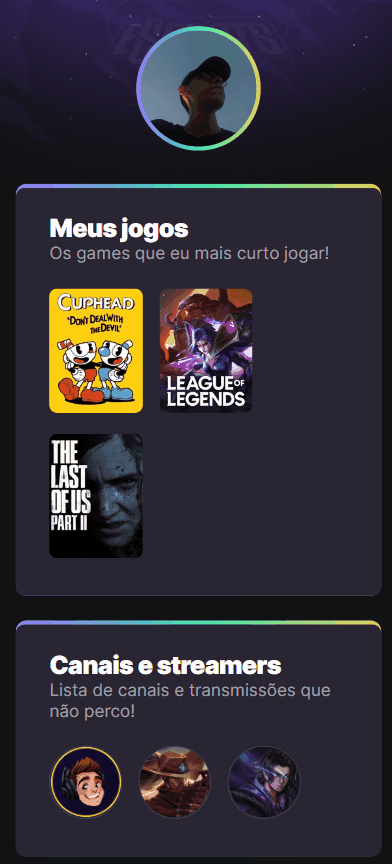

# **NLW eSports Explorer**

## :triangular_ruler: **Projeto**
Este projeto foi feito no evento Next Level Week (NLW) da Rocketseat e se baseia em uma página com cards que mostram algumas informações sobre mim.

## :link: **Link**
*[Link do projeto.](https://davsilvam.github.io/nlw-esports-explorer/)*

## :art: **Visual do Projeto**
### *Desktop e Telas Maiores*
<h1 align="center">
    
</h1>

### *Mobile e Telas Menores*
<h1 align="center">
    
</h1>

## :rocket: **Funcionalidades do Projeto**
O projeto conta atualmente com:
* Foto do perfil do Github no cabeçalho.
* Links para a área dos jogos na Twitch.
* Links para os canais da Twitch que acompanho.
* Links com minhas redes sociais.
* Animações CSS e design responsivo.

## :wrench: **Tecnologias**
Tecnologias utilizadas no projeto.
* HTML;
* CSS;
* Visual Studio Code;
* Google Fonts.

---
